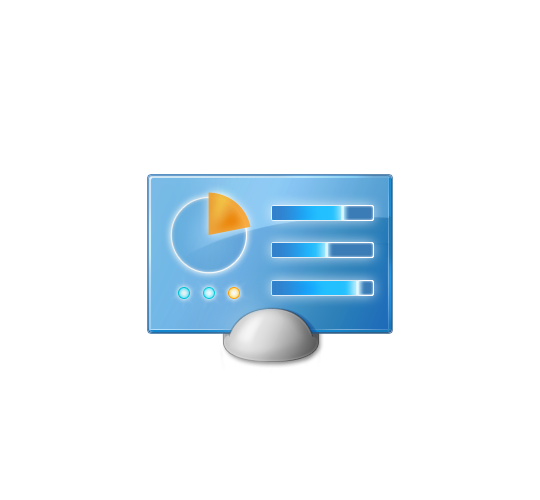

<div align="center">


</div>

<br>

<table width="100%">
<tr>
<td style="background:#0A246A;">

 &nbsp;**My Computer**

</td>
</tr>
</table>

```
C:\Users\Joycraft> whoami
```

- Soy Joy xdxdxd
- Sin la música no vivo
- Soy furrito :3
- Me gustan mucho las galletas Oreo uwu


<br>

<table width="100%">
<tr>
<td style="background:#0A246A;">

 &nbsp;**Tech Stack**

</td>
</tr>
</table>

<div align="center">


</div>

<br>

<div align="center">


</div>

<br>

<table width="100%">
<tr>
<td style="background:#0A246A;">

 &nbsp;**System Status**

</td>
</tr>
</table>

<div align="center">


</div>

<br>

<table width="100%">
<tr>
<td style="background:#0A246A;">

 &nbsp;**Contribution Snake**

</td>
</tr>
</table>

<div align="center">

<picture>
  <source media="(prefers-color-scheme: dark)" srcset="https://raw.githubusercontent.com/joycraftowo/joycraftowo/output/github-contribution-grid-snake-dark.svg" />
  <source media="(prefers-color-scheme: light)" srcset="https://raw.githubusercontent.com/joycraftowo/joycraftowo/output/github-contribution-grid-snake.svg" />
  
</picture>

</div>

<br>

<table width="100%">
<tr>
<td style="background:#0A246A;">

 &nbsp;**Contact**

</td>
</tr>
</table>

<div align="center">

<a href="https://x.com/Joycraftzzz" target="_blank">
  
</a>


</div>

<br>

<div align="center">


</div>

<br>

<div align="center">


<sub>Thanks for visiting! It's now safe to turn off your computer 🖥️</sub>

</div>
